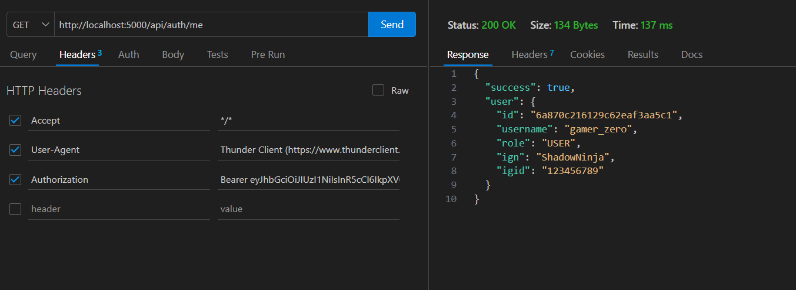
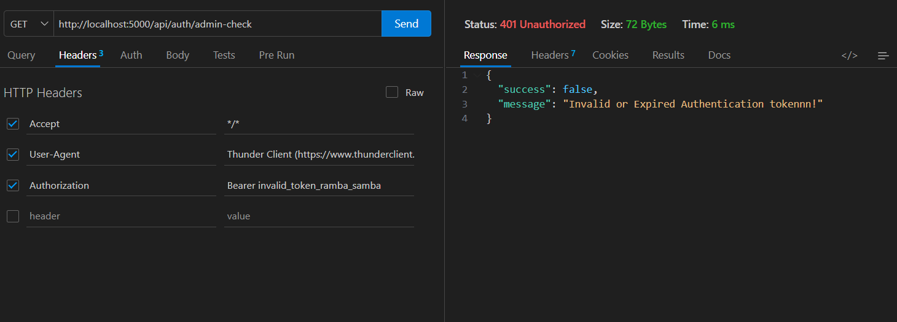
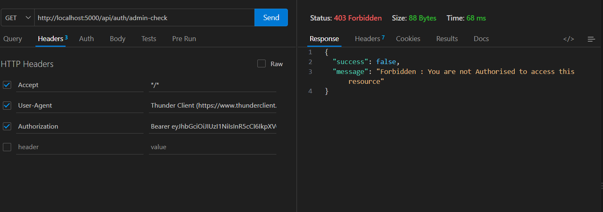
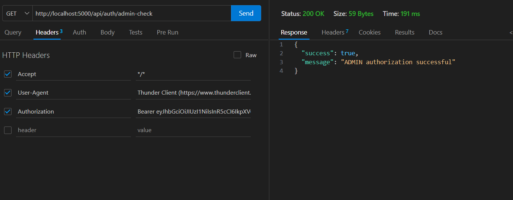

This Script will tell you how we actually moved step by step on each DAY 


## Day 1 :
- Project architecture
- folder initialisation

#
## Day 2 :
- Installed node package manager ( `npm init -y` )
- Installed express.js (`npm install express`)


#
## Day 3:
- Installed `nodemon` (which is a dev dependency) - helps automatically restarting server when any change is made
- Installed (`.dotenv`) & setup .env file
- Installed `cors` [allows frontend-backend communication on different ports] ,
- Installed `express.json()` [allows json parsing of req.body]
- Tested POST api using `Thunder Client Extension` in VS CODE
- Separated routes from the main server.js & mounted the prefix "`/api`" using Express Router on another file inside /routes
- `app.use("api/", routePath)` redirects any url with prefix "`/api`" to that router

-> ADDED FRONTEND
- setup the basic frontend using `React (vite)` framework 
- vite handled automatically initial setup
- replaced the default `frontend/src/app.jsx` contents with a simple working frontend application

#
## Day 4:
- staging area in HTML - named as `"root"`. It has the source script as "`main.jsx`"
- "`main.jsx`" eventually uses "`App.jsx`"
- implemented `fetch()` : makes an HTTP request to provided URL
- understood `http response` : StatusCode, Header, Body, response.ok
- implemented `.env in frontend` to store the backend base url
- implemented `useEffect()` : runs code inside during 2 scenarios . First when page loads/reloads & second when a state of any variable in dependency array [] changes
- implemented `useState()` : remembers the state/status of a ui element. It returns the variable & setter function to change the value inside the variable

-> ERRORS FACED   

- missed `export app default` in the "App.jsx"  


The Exact Basic Flow we built for now:
```
frontend/index.html         (the main frontend gateway)
        ↓
frontend/src/main.jsx       (React access "root" stage )
        ↓
frontend/src/App.jsx        (main.jsx calls App.jsx to render)
        ↓
fetch()                     (app.jsx calls http req)
        ↓
HTTP GET /api/health        (backendBaseURl config in .env)
        ↓
backend/src/server.js       (req reaches backend GATEWAY)
        ↓
CORS middleware             (allows req from different PORT)
        ↓   
JSON middleware             (allows json parsing )
        ↓
app.use("/api", healthRoutes)   (Routes req with prefix /api)
        ↓
backend/src/routes/healthRoutes.js  (the exact router file)
        ↓
router.get("/health")       (mounted prefix /api + /health )
        ↓
res.status(200).json(...)   (sets the response status)
        ↓
HTTP response               (sends back the response)
        ↓
App.jsx                     (req reaches app.jsx)
        ↓
response.json()             (parses to json)
        ↓
setBackendMessage()         (changes UI STATE & reRenders)
        ↓
React re-render
        ↓
Browser UI                  (the new message from backend is shown)
```
a more high level flow for now is simply 
```
BASIC WORKING FRONTEND & BACKEND COMMUNICATION

React :5173
    ↓ HTTP
Express :5000
    ↓ JSON
React :5173
```

#
## Day 5: 
- learnt about the storage architecture of MongoDB :   
`Database` -> `Collections` -> `Documents` ->`Fields`
- understood JSON vs BSON(Binary JSON used by MongoDB)
- understood `_id` of documents & `ObjectId()` 
- understood flexiblity of mongoDB document `BSON` database & necessity of schema-model in `Mongoose`
- `MongoDB Atlas setup` Done & `connection Strings` Setup
- Understood Atlas Architecture :   
`Project`->`Cluster`->`Databases`->`Documents`->`Collections`

MONGOOSE FUNDAMENTALS
- Learnt the Mongoose functionality & behaviour of `Mongoose Document` (a special type of javascript object)
- Understood the difference : `Mongoose Schema` VS `Mongoose Model` VS `Mongoose Document`
- Understood the difference : `Model` VS `Controller`
- Understood the difference : `Validation` VS `Authorisation`

``` 
Mongoose Schema - Template Blueprint
Mongoose Model - JS interface built using that Schema to do CRUD operations
Mongoose Document - The actual object of that model. It is JS object + with database Methods
```
- Learnt the ODM : object Data Modelling in Mongoose as a interface b/w javascript object & MongoDB Document
- Learnt the CRUD ops via Mongoose Model : `model.create()`,` model.find()`, `model.findById()`,` model.findOne()`, `model.findByIdAndUpdate()`, `model.findByIdAndDelete() ` 
- understood relationships using ObectId() & how to reference

#
## Day 6:
- understood more detailed `field definitions` in `MongooseSchema`: type, required, unique, trim, enum, default, timestamps, uppercase, lowercase.
- Installed Mongoose - `npm install mongoose`
- Sucessfully connected MongoDB (Atlas)
- Created the `user` Schema in backend/src/models/User.js
- Created the `tournament` Schema in backend/src/models/Tournament.js
- Created the `registration` Schema in backend/src/models/Registration.js


PROBLEM FACED : 
>we cannot choose a unique id for example `userId` or a `tournamenId` to uniquely identify a registration. Hence we used a combined unique key made from {`userId`, `tournamentId`}. This means the user can only register for a particular tournament only once.
- Created the `Payment` schema 
- Created the `Notification` schema 
- Created the `Result` schema to build the `Leaderboard`
> I used each entry of the leaderboard to be unique. Thats what the documents of the `Result` collection represent. This can be done by choosing each result as a unique combination of `{userId, TournamentId}`. Also `{TournamentId, RankNumber}`should be unique.
- maintained 1 rank-per-tournament & 1 unique-user-per-tournament
- built indexing for faster lookups & performance in mongoose schema    
- Query indexes for tournament, registration, payment, notification, result.
-  understood the functionality of `populate()`: populates the field, which is referencing to another document & extracts particular fields of the referenced documents which are provided in second parameter of the function.
- added `src/scripts/seetTestData.js` to test the connectivity & relationship, constraints, duplicate constraints & tested with custom Data. Use `npm run seet:test` to run database schema testing.


#
## Day 7:
- successfully tested the `api/auth/register` & `api/auth/login` routes using ThunderClient
- installed bcrypt `npm install bcrypt`
- unserstood the functionality of `bcrypt.hash()` and `bcrypt.compare()`
- added full fledged functional logic of `login` and `register`.


#
## Day 8:
- understood the architecture of jsonWebToken(JWT) : `HEADER`.`PAYLOAD`.`SIGNATURE` 
- understood the functionality of `jwt.sign()` and `jwt.verify()`
- implemented `generateToken.js` logic for token generation
- update userSchema to store passwordhash instead of password & updated REGISTER logic in authController.
- successfuly tested `register` & `login` involving bcrypt, jwt using ThunderClient.
- added `middleware/authMiddleware.js` it handles :
    - extracton of token from `Bearer Header`
    - verification of token using `jwt.verify()`
    - attaching `req.userId` to the request body and proceeding to next()


#
## Day 9:
- attached `user` document in `req.user` instead of just `req.userId` after fetching from Database  
- tested the `protected route` + with common `USER` privilege.


RBAC [Role Based Access Control]
- handled role protection; everybody will be registered as default `role: USER`
- understood `router.get("/path", fun1, fun2, fun3)`; & usage of `next()` to continue the chain and pass control to the next middleware in the sequence.

- tested the `protected route` + with only `ADMIN` privilege.
#### a) with invalid credentials (token)
  

#### b) with USER credentials (token)
  

#### c) with ADMIN credentials (token)


#
## Day 10:
- defined tournaments routes for CRUD operations on `Tournament.js`